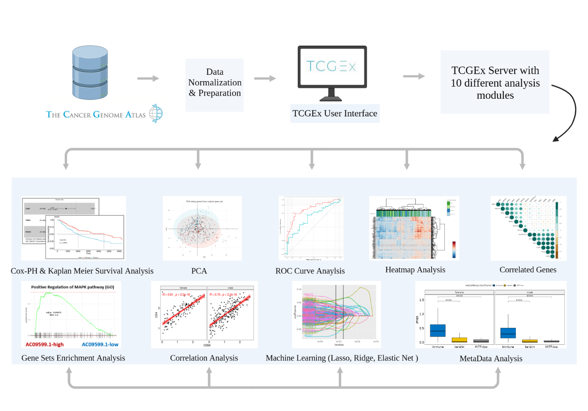
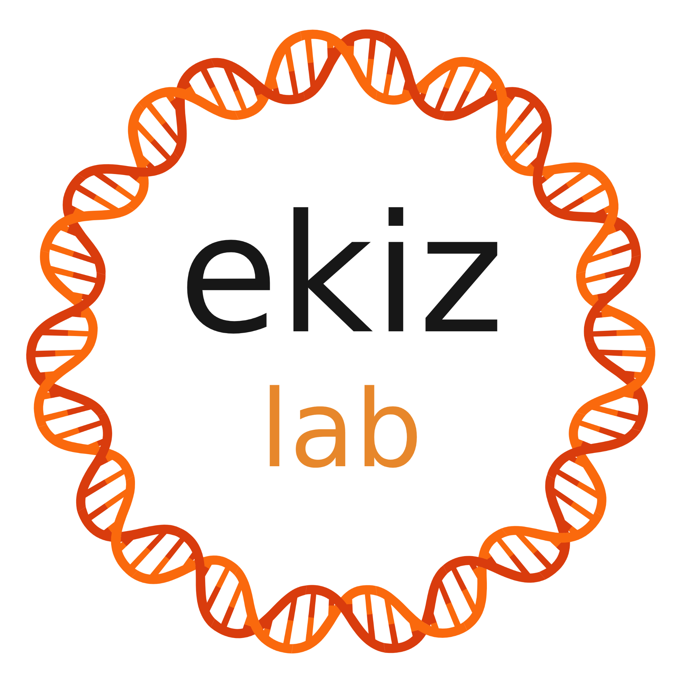

TCGExplorer.  
High-throughput cancer data analyzer

---------------------------------------------------

We created TCGEx to enable wider use of TCGA data and facilitate researchers with no coding background to perform comprehensive analyses. TCGEx provides a responsive and user-friendly interface with customizable parameters that allows tailoring the analyses to different scientific contexts. This open-source tool written in R/Shiny offers a point-and-click solution for performing complex analyses of human cancer data and it can generate publication-ready plots to accelerate cancer research.

Intersection of disciplines 
---------------------------------------------------------------------------------------------------------------

Making sense of high-throughput cancer data requires a harmonious integration of molecular biology, statistics, and computer science. These advanced fields arguably differentiated from each other so much that it became necessary to establish new bridges between them to accelarate research.

We developed TCGEx with this vision in our minds. Based on our prior expertise and the cancer research literature, we identified most commonly utilized analytical methods and packaged them into user-friendly modules with flexible user-selected parameters. This way, users can customize the analyses to their specific needs and utilize TCGEx in a variety of research contexts. We realize that learning software tools can be challenging, especially for researchers who have not dealt with high-throughput data previously. To ease this pain, we developed step-by-step guides in each module that introduce the necessary knobs and buttons to users to help them get started. Significantly, interactive analysis modules can be conveniently adapted to a range of study contexts leading to publication-ready plots in a few seconds. 

The team behind TCGEx
------------------------------------------

TCGEx was developed by the tremendous graduate and undergraduate students of the <a href="https://www.atakanekiz.com?utm_source=tcgex_source&utm_id=github"><b>Ekiz Lab</b></a> in the Department of Molecular Biology and Genetics at Izmir Institute of Technology, Turkey.

* * *

-----------------------

