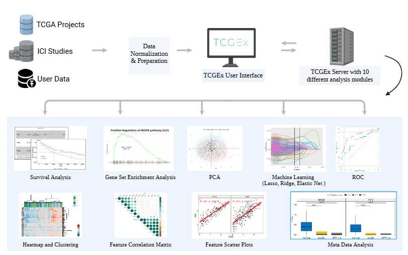

The Cancer Genome Explorer  (TCGEx)
-------------------------------------------------

Summary
---------------------------------------------------------
The Cancer Genome Atlas (TCGA) initiative has been essential for revealing key mechanisms in human cancer leading to the development of novel therapeutics. TCGA data repository consists of genomic, transcriptomic, epigenetic data and clinical metadata from 11000+ patients across 33+ cancer types. Analysis of such large data sets require coding skills that are associated with a steep learning curve for most non-specialists. To enable a wider utilization of TCGA gene expression data, we introduce The Cancer Genome Explorer (TCGEx), a web-based visual data analysis interface that can perform a number of sophisticated analyses ranging from survival modeling and gene set enrichment analysis to unsupervised clustering and linear regression-based machine learning. TCGEx offers customizable options to tailor the analysis to different study contexts and helps generate publication-ready plots. Developed using R/Shiny framework, this open-source tool enables researchers with no programming expertise to analyze TCGA RNA and miRNA sequencing data from multiple angles. Pre-processed data in TCGEx contains cancer subtype information as well as previously reported intratumoral immune cell signatures making it possible to investigate the possible tumor-immune interactions. TCGEx, available at https://tcgex.iyte.edu.tr, provides an interactive solution to extract meaningful insights from TCGA data and guide scientific research.

Motivation
---------------------------------------------------

We created TCGEx to enable wider use of TCGA data and facilitate researchers with no coding background to perform comprehensive analyses. TCGEx provides a responsive and user-friendly interface with customizable parameters that allows tailoring the analyses to different scientific contexts. This open-source tool written in R/Shiny offers a point-and-click solution for performing complex analyses of human cancer data and it can generate publication-ready plots to accelerate cancer research.

Intersection of disciplines 
---------------------------------------------------------------------------------------------------------------

Making sense of high-throughput cancer data requires a harmonious integration of molecular biology, statistics, and computer science. These advanced fields arguably differentiated from each other so much that it became necessary to establish new bridges between them to accelarate research.

We developed TCGEx with this vision in our minds. Based on our prior expertise and the cancer research literature, we identified most commonly utilized analytical methods and packaged them into user-friendly modules with flexible user-selected parameters. This way, users can customize the analyses to their specific needs and utilize TCGEx in a variety of research contexts. We realize that learning software tools can be challenging, especially for researchers who have not dealt with high-throughput data previously. To ease this pain, we developed step-by-step guides in each module that introduce the necessary knobs and buttons to users to help them get started. Significantly, interactive analysis modules can be conveniently adapted to a range of study contexts leading to publication-ready plots in a few seconds. 

The team behind TCGEx
------------------------------------------

TCGEx was developed by the tremendous graduate and undergraduate students of the <a href="https://www.atakanekiz.com?utm_source=tcgex_source&utm_id=github"><b>Ekiz Lab</b></a> in the Department of Molecular Biology and Genetics at [Izmir Institute of Technology](https://www.iyte.edu.tr), Turkey.

* * *

-----------------------

